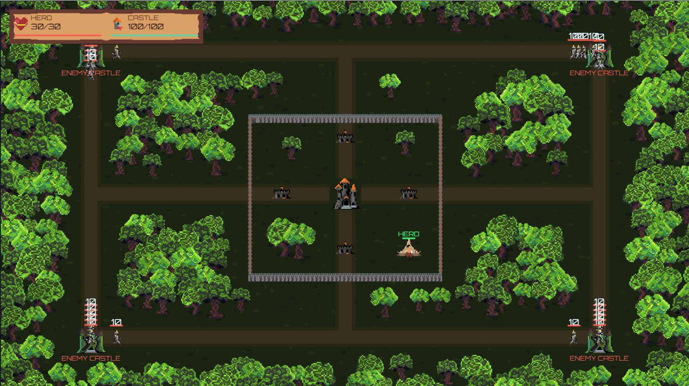
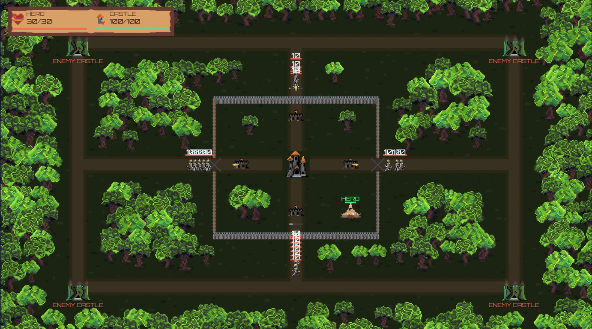
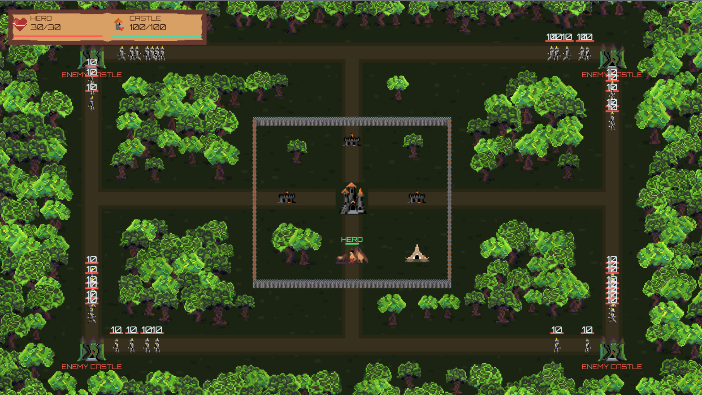

# tp1-cg
# Jogo: Off Tower

## O Jogo

**Off Tower** é um jogo de defesa de torres em desenvolvimento para a disciplina de Computação Gráfica. A proposta é proteger uma cidade contra ondas de inimigos, combinando torres defensivas e um herói responsável pela manutenção das construções. Os inimigos vem em ondas por um caminho específico e você pode clicar para dar dano e as torres menores atiram.

## Criadores

- **Fernanda Moreira Thomaz** 
  Contato: [e-mail: fermtthomaz@gmail.com] 
- **Mariana Matias do Nascimento**
  Contato: [e-mail: mmatias0310@gmail.com] 

## Media kit

  
   
  <i>Visão geral do cenário e das defesas</i>

  
   
  <i>Torres defendendo a cidade durante uma onda de inimigos</i>

  
   
  <i>Herói atuando na manutenção</i>

## Opcionais

- **Texturas animadas:** quando os personagens andam suas pernas se movimentam.
- **Telas:** tem menu principal, e game over. 
- **Inimigos em ondas:** ondas com quantidade crescente de inimigos e intervalo de preparação entre elas.
- **Caminhos dos inimigos:** movimentação por uma sequência de pontos predefinidos, com ataques às defesas encontradas no percurso.
- **Progressão da torre:** estrutura básica de níveis que aumentam o dano dos ataques, no último nível de atualização da pra escolher o tipo de torre mas elas não tem comportamentos específicos, só muda visualmente mesmo.
- **Herói:** lógica de deslocamento até construções e execução de tarefas de manutenção, mas ele não ataca inimigos, nosso herói foca em proteger a cidade trabalhando nela.
- **Implementação cirativa:** o herói construtor é uma espécie de implementação criativa já que ele foge do padrão atacar inimigos?

## Créditos

- **Sprites de personagens e estruturas:** [Autor: Leornardo Resende Lopes] [Github: illinis].
